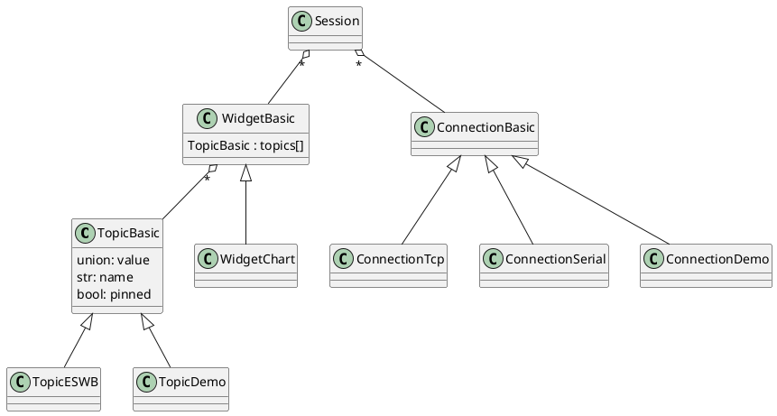

TODO

```puml
@startuml

class TopicBasic {
    union: value
    str: name
    bool: pinned
}

class TopicESWB
class TopicDemo

class WidgetBasic {
    TopicBasic : topics[]
}

class WidgetChart

WidgetBasic "*" o-- TopicBasic

WidgetBasic <|-- WidgetChart

TopicBasic <|-- TopicESWB
TopicBasic <|-- TopicDemo

class ConnectionBasic
class ConnectionTcp
class ConnectionSerial
class ConnectionDemo

ConnectionBasic <|-- ConnectionTcp
ConnectionBasic <|-- ConnectionSerial
ConnectionBasic <|-- ConnectionDemo

class Session

Session "*" o-- ConnectionBasic
Session "*" o-- WidgetBasic

@enduml
```
